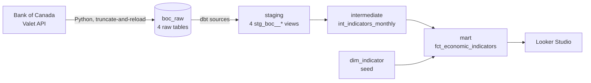
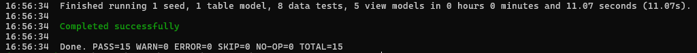
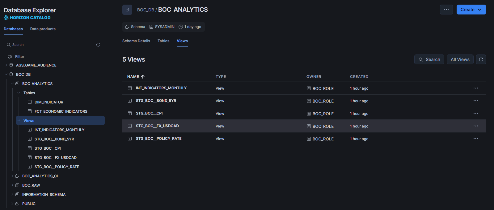
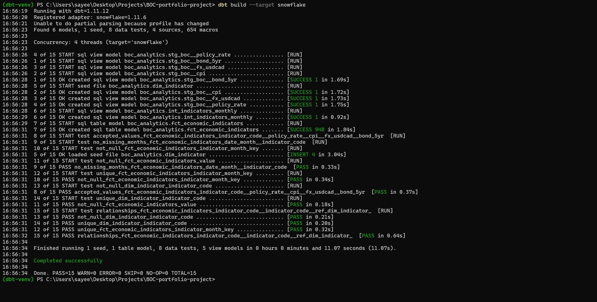
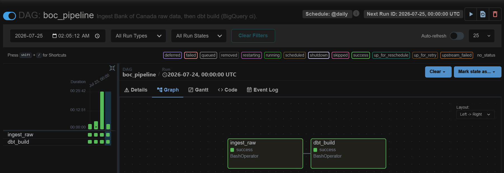

# BoC Economics — dbt Analytics Pipeline

[](https://github.com/xprsayeem/boc-economics-dbt/actions/workflows/ci.yml)

An end-to-end analytics-engineering pipeline over Canadian macroeconomic data:
**Bank of Canada Valet API → BigQuery *or* Snowflake → dbt → Looker Studio.**
Ingestion in Python, transformation in one **warehouse-agnostic** dbt project
(staging → intermediate → mart star schema), data-quality tests including a
custom one, and GitHub Actions CI that rebuilds and tests on every pull request.

**➡️ [Live Looker Studio dashboard](https://datastudio.google.com/s/uwB1ME5aTW8)**

---

## The question it answers

How have the Bank of Canada's **policy rate**, **inflation (CPI)**, the
**CAD/USD exchange rate**, and the **5-year Government of Canada bond yield**
moved together - for example through the 2022–24 monetary-tightening cycle?
The pipeline lands these four indicators on a common monthly grain so they can
be read on one timeline.

## Architecture



- **Ingestion** (`ingestion/ingest_boc.py`) pulls each series from the Valet API
  and loads it into `boc_raw` in BigQuery. Idempotent, truncate-and-reload, with
  retry/backoff. No incremental logic or orchestration — deliberately simple.
- **Staging** cleans and types each series and standardizes the date column, one
  model per source series, at native grain.
- **Intermediate** unions the four series into a tidy long table on a common
  **monthly** grain — daily series collapse to their month-end observation; CPI
  is already monthly.
- **Mart** is a small star: the `fct_economic_indicators` fact (one row per
  month per indicator) joined to the `dim_indicator` dimension (a dbt seed).

## The four indicators

| `indicator_code` | Indicator | Valet series | Native frequency |
|---|---|---|---|
| `policy_rate` | Target for the overnight rate | `V39079` | daily |
| `cpi` | Total Consumer Price Index (index level) | `V41690973` | monthly |
| `fx_usdcad` | USD/CAD average exchange rate | `FXUSDCAD` | daily |
| `bond_5yr` | GoC 5-year benchmark bond yield | `BD.CDN.5YR.DQ.YLD` | daily |

## Modeling layers

```
models/
├── staging/         stg_boc__policy_rate, stg_boc__cpi,
│                    stg_boc__fx_usdcad, stg_boc__bond_5yr   (views)
│                    + _sources.yml over boc_raw
├── intermediate/    int_indicators_monthly                 (view, monthly union)
└── marts/           fct_economic_indicators                (table, the fact)
seeds/               dim_indicator.csv                       (the dimension)
```

`fct_economic_indicators` carries a surrogate key `indicator_month_key`
(`dbt_utils.generate_surrogate_key` over `date_month` + `indicator_code`) that
enforces the grain. Every model, source, and seed is documented in a schema YAML.

## Testing

`dbt build` runs **8 data tests**, all green:

- Built-in: `unique` + `not_null` on the fact's surrogate key, `not_null` on
  `value`, `relationships` from the fact to `dim_indicator`, `accepted_values`
  on `indicator_code`, and `unique` + `not_null` on the dimension key.
- **Custom generic test** (`tests/generic/no_missing_months.sql`): asserts that
  each series has **no monthly gaps** over its own history. It is partition-aware
  (checks each `indicator_code` separately), so series with different start dates
  — e.g. FX only goes back to 2017 — are each validated over their own span
  rather than false-positiving on the years before they existed.

## CI/CD

`.github/workflows/ci.yml` runs on every pull request to `main`: it installs the
pinned dependencies, writes the `GCP_SA_KEY` secret to a key file, points
`DBT_KEYFILE` at it, and runs `dbt build` against a **separate `boc_analytics_ci`
dataset** so CI never touches the main `boc_analytics` data. Auth is the same
`DBT_KEYFILE` env var used locally, so CI is a config swap rather than a rewrite.

## Warehouse portability — BigQuery + Snowflake

The same dbt project runs on **both BigQuery and Snowflake**, selected by target:

| Target | Warehouse | Schema / dataset | Used by |
|---|---|---|---|
| `dev` | BigQuery | `boc_analytics` | local (primary) |
| `ci` | BigQuery | `boc_analytics_ci` | PR CI |
| `snowflake` | Snowflake | `BOC_ANALYTICS` | local |
| `snowflake_ci` | Snowflake | `BOC_ANALYTICS_CI` | manual CI |

BigQuery stays primary — it feeds the dashboard and the PR CI. Portability comes
from **dbt cross-database macros** rather than warehouse-specific SQL:
`dbt.date_trunc`, `dbt.datediff`, `dbt.type_float`, and
`dbt_utils.generate_surrogate_key`, plus a target-aware source database
(`{{ target.database }}`). `QUALIFY` needed no change — Snowflake supports it
natively. All 8 tests, including the custom `no_missing_months`, pass on both.

Snowflake auth is **key-pair** via env vars (mirroring `DBT_KEYFILE`). Full setup
— objects, keys, env vars — is in [`snowflake/README.md`](snowflake/README.md):

```powershell
python ingestion\ingest_boc.py --warehouse snowflake
dbt build --target snowflake
```

Snowflake CI is **manual** (`.github/workflows/ci-snowflake.yml`, `workflow_dispatch`)
so it never becomes a failing check after the time-limited trial lapses.

### Evidence (Snowflake trial)

Captured while the trial was live, so the proof outlives it.

**Green `dbt build --target snowflake`:**



**Models in the Snowflake UI (`BOC_DB.BOC_ANALYTICS`):**



**Tests (8 passing on Snowflake):**



## Orchestration — Airflow (local)

A local **Apache Airflow** stack (Docker Compose, LocalExecutor) runs the pipeline
on a schedule: one DAG, **`ingest_raw >> dbt_build`**, `@daily`, `catchup=False`,
`retries=2`, targeting BigQuery `ci`. dbt runs from an isolated venv baked into the
image so its dependencies never collide with Airflow's. Auth is the same
`DBT_KEYFILE`, mounted read-only — nothing secret is committed. Full setup in
[`airflow/README.md`](airflow/README.md):

```powershell
cd airflow
Copy-Item .env.example .env      # set GCP_KEYFILE_HOST
docker compose up -d --build     # UI at http://localhost:8080
```



## Run it locally

Prerequisites: a GCP project with BigQuery, a service-account key with
`bigquery.dataEditor` + `bigquery.jobUser`, and a `boc_economics` profile in
`~/.dbt/profiles.yml` (dataset `boc_analytics`, location `northamerica-northeast2`).

```powershell
# 1. Environment
python -m venv dbt-venv
.\dbt-venv\Scripts\Activate.ps1
pip install -r requirements.txt

# 2. Auth (point at your service-account key)
$env:DBT_KEYFILE = "$HOME\.gcp\dbt-runner-key.json"

# 3. Ingest raw data into boc_raw
python ingestion\ingest_boc.py

# 4. Build + test the dbt project
dbt build          # runs seed, models, and tests in dependency order
```

`dbt debug` verifies the connection and project configuration.

## Tech stack

| Layer | Tool |
|---|---|
| Warehouse | BigQuery (`northamerica-northeast2`, primary) + Snowflake (second target) |
| Transformation | dbt Core 1.11 + dbt-bigquery / dbt-snowflake, cross-database macros |
| Ingestion | Python (`requests`) → `boc_raw` (either warehouse via `--warehouse`) |
| Orchestration | Apache Airflow (local, Docker Compose, LocalExecutor) |
| CI/CD | GitHub Actions — `dbt build` on PR (BigQuery); manual Snowflake job |
| Visualization | Looker Studio on `fct_economic_indicators` |

## Design decisions

- **Monthly grain.** Monthly is the cleaner story for a dashboard, so daily
  series are aggregated to their month-end value rather than shown at daily
  resolution.
- **Ragged histories are expected.** Each series starts when its Valet history
  starts (CPI 2000, bond 2001, policy rate 2009, FX 2017); the tests account for
  this rather than assuming a shared start date.
- **Build small and ship.** Scope was intentionally tight, only four series, a
  minimal star, a focused test suite — to demonstrate a complete, correct
  pipeline rather than a sprawling one.
